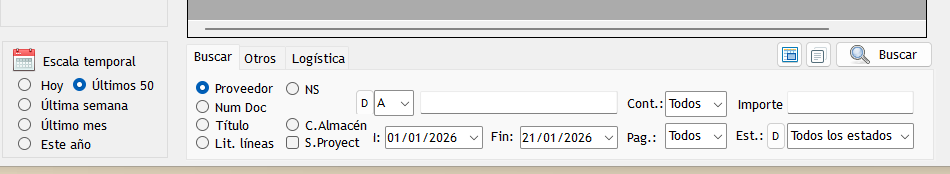

## ❓ “Mis facturas han desaparecido de la lista de facturas emitidas, ¿qué ha pasado?”

Esta es una consulta muy habitual en el SAT, especialmente al cambiar de año.

---

## ✅ La respuesta rápida

Las facturas **no han desaparecido**.  
Siguen estando registradas correctamente en el sistema, pero **no se muestran debido a los filtros activos en la pantalla**.

---

## 🔍 ¿Qué está ocurriendo realmente?

En las pantallas generales de facturas, tanto de **ventas** como de **compras**, Eclipse ERP aplica **filtros automáticos por defecto** para mejorar el rendimiento y la velocidad de carga.

### 📅 Filtro de fechas
- **Fecha desde:** 01/01 del año en curso  
- **Fecha hasta:** fecha actual  

### 📄 Límite de registros
- Se muestran **solo los últimos 50 registros**

Gracias a estos filtros, las pantallas se cargan de forma más ligera y rápida, especialmente en empresas con un gran volumen de facturación.

---

## ⚠️ ¿Por qué no veo las facturas del año anterior?

Si estamos a inicio de año, por ejemplo en enero:

Las facturas emitidas en años anteriores:
- ❌ Quedan fuera del rango de fechas por defecto  
- ❌ No se muestran aunque existan  

Esto puede dar la sensación de que “han desaparecido”, pero **simplemente no cumplen los filtros actuales**.

---

## 🛠️ ¿Cómo puedo volver a verlas?

Para visualizar facturas de ejercicios anteriores:

1. Modifica el **filtro de fechas**, ampliando el rango (por ejemplo, desde `01/01` del año anterior).
2. Si es necesario, aumenta el **número máximo de registros** a mostrar.
3. Refresca la pantalla.

Una vez hecho esto, las facturas **volverán a aparecer con normalidad**.

