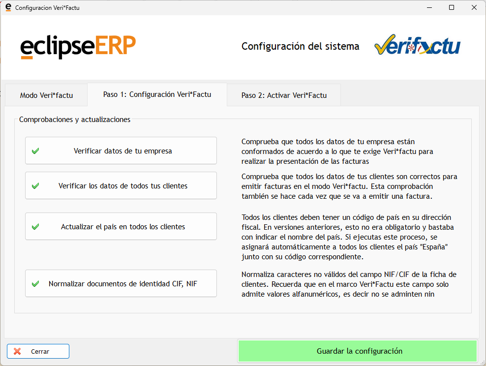
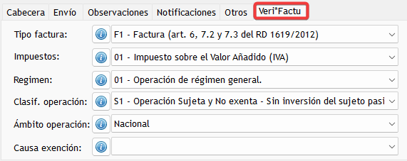
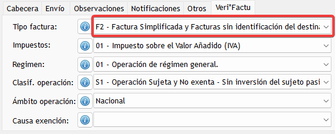
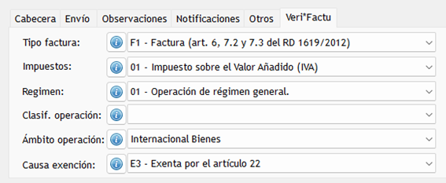
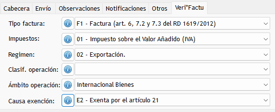

# ✔️ ¿Estás preparado para la conexión con Veri*Factu?

Antes de activar la conexión real con Veri*Factu es importante revisar una serie de puntos clave para asegurar que todo funcionará correctamente. A continuación encontrarás una guía sencilla y práctica para dejar tu aplicación preparada.

---

# ✔️ Checklist final antes de la conexión real

## 1. Estar en una versión actualizada del programa
Debes comprobar que trabajas con una **versión 2025.11 o superior**.  
Esto garantiza que tu aplicación incluye todas las funcionalidades obligatorias para poder conectarse con Veri*Factu.

---

## 2. Adaptación de formatos de factura personalizados (IMPORTANTE)
Si utilizas **formatos de factura personalizados (a medida)**, es imprescindible revisarlos y actualizarlos antes de activar el modo Veri*Factu, asegurándonos así de que:

- El formato incluye el **código QR obligatorio** que genera el sistema.  
- Si tienes varios formatos, **todos deben actualizarse**.

Si no actualizas tus formatos, la factura impresa **no cumplirá el estándar Veri*Factu**, aunque el envío telemático sea correcto.

---

## 3. Revisar y completar los datos de tu empresa
Accede al menú:

**Global > Empresa**

Allí encontrarás varios campos **resaltados en amarillo** que deben estar obligatoriamente cumplimentados.  
Asegúrate de que están correctos y actualizados antes de continuar.

---

## 4. Comprobar que los datos de tus clientes están completos
En la ficha de cada cliente verás que algunos campos aparecen en **color amarillo**. Son obligatorios y deben estar cubiertos correctamente.

### **Datos obligatorios del cliente**
- **CIF/NIF** (solo números y letras; no se permiten espacios, guiones, barras u otros símbolos).  
- **Nombre Fiscal**  
- **Dirección completa**  
- **Población**  
- **Código Postal**  
- **Provincia**  
- **Código de país** y **País**  
  - Ambos campos son obligatorios.  
  - Puedes utilizar la **lupa** para seleccionar el código de país correcto.

> 💡 **Consejo:**  
> Desde la opción de **Configuración de Veri*Factu** encontrarás herramientas para ayudarte a revisar y completar estos datos más fácilmente.

---

## 5. Confeccionar correctamente tus facturas antes de emitirlas
Cada factura debe enviarse a la Agencia Tributaria con una información específica que indique **qué tipo de factura es**.

Para ello, en la cabecera de la factura tienes la pestaña:

👉 **Pestaña “Veri*Factu”**

Desde aquí podrás indicar los parámetros necesarios para clasificar la factura correctamente.

### 🔧 **Valores por defecto del programa**
El programa establece por defecto la configuración típica de una factura:

Factura ordinaria emitida a un **cliente nacional**, con **todos los datos completos**, en **régimen general** y **sujeto/no exento**.

Este es el caso más habitual, pero existen otras situaciones en las que deberás ajustar los parámetros.

---

# 📚 Ejemplos de situaciones habituales

> ⚠️ **IMPORTANTE:**  
> Los siguientes casos son solo ejemplos orientativos.  
> Cada situación concreta puede variar y es recomendable consultarla con tu asesor fiscal para asegurarte de que seleccionas los datos correctos.

---

## **Caso General**
Factura ordinaria emitida a un cliente nacional, con todos los datos completos, en régimen general y sujeto/no exento.

---

## **Factura Simplificada**
En la aplicación puedes emitir **facturas simplificadas** (ventas al contado sin identificación de cliente).

---

## **Venta de bienes a un país de la Unión Europea**
Se trata de **operaciones intracomunitarias**.  
La causa de exención aplicable dependerá de cada caso particular, por lo que es imprescindible consultarlo con tu asesor.

---

## **Venta de bienes a países fuera de la Unión Europea (Exportaciones)**
En este caso también será necesario especificar la causa de exención correspondiente, siempre en función de cada situación particular.

