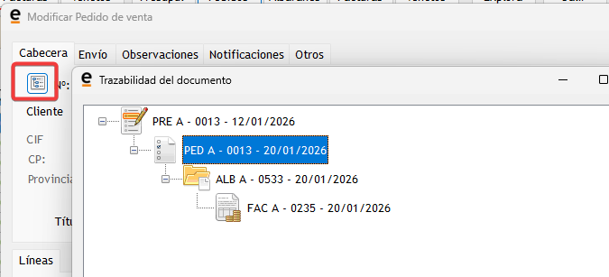

# 🔗 Trazabilidad de documentos

La trazabilidad permite visualizar **todo el recorrido de un documento**, desde su origen hasta el último documento generado a partir de él.

Por ejemplo:

- Presupuesto → Pedido  
- Pedido → Albarán  
- Albarán → Factura  

Desde cualquiera de estos documentos se puede conocer:
- Su **procedencia**
- Los **documentos generados posteriormente**
- Fechas, numeración y ejercicio de cada uno

---

## 🔘 Botón de trazabilidad del documento

En cualquier documento de **ventas o compras**, al entrar en modo **ver o modificar**, se dispone del **botón de trazabilidad**.

Este botón permite:
- Consultar la **cadena completa de documentos relacionados**
- Visualizarla en forma de **árbol jerárquico**
- Acceder directamente a cada documento

---

## 🌳 Visualización de la cadena de documentos

Al pulsar el botón de trazabilidad:

- Se muestra un árbol con todos los documentos relacionados.
- Cada elemento representa un documento generado a partir del anterior.
- Al **hacer clic sobre cualquiera de ellos**, se abre automáticamente la ventana correspondiente.

Esto permite navegar por toda la operación **sin salir del documento actual**.

---

## 🧾 Ejemplo práctico

Una operación habitual puede seguir esta secuencia:

- Presupuesto aprobado  
- Conversión a pedido  
- Conversión del pedido en albarán  
- Conversión del albarán en factura  

Desde el botón de trazabilidad de **cualquiera de estos documentos**, el usuario puede ver y abrir toda la secuencia completa.

---

## ⚠️ Caso habitual: documento creado en otro año

Una situación muy común es la siguiente:

- Al convertir un pedido en albarán, el usuario introduce por error:
  - Año **2027** en lugar de **2026**
- El documento se crea correctamente, pero:
  - No aparece en los listados habituales
  - No se encuentra al buscarlo por fechas del año actual

En este caso:
- El documento **existe**
- Simplemente pertenece a **otro ejercicio**

Gracias a la trazabilidad:
- Se detecta inmediatamente el año real del documento
- Se puede acceder a él directamente sin cambiar filtros

---

## ⭐ Ventajas de la trazabilidad

- 🔍 Localización rápida de documentos “desaparecidos”
- 📆 Detección de errores de fecha o ejercicio
- 🔁 Seguimiento completo de una operación
- 🚀 Ahorro de tiempo para usuarios y SAT

---

## 💡 Recomendaciones de uso

- Utilizar siempre la **trazabilidad** cuando no aparezca un documento generado.
- Revisar fechas y ejercicio al convertir documentos.
- Antes de contactar con el SAT, comprobar la cadena completa desde el documento origen.

---